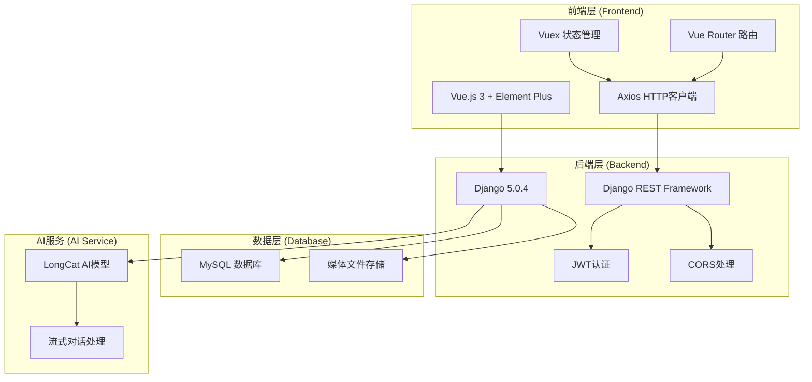

# 🐾 吉祥宠物商城系统 (Pet Marketplace System)

[](https://opensource.org/licenses/MIT)
[](https://www.python.org/)
[](https://www.djangoproject.com/)
[](https://vuejs.org/)
[](https://element-plus.org/)

> 🌟 一个现代化的宠物商城系统，集成AI宠物顾问、商品管理、订单处理等功能，为宠物爱好者提供一站式服务平台。

## 📋 目录

- [✨ 项目特色](#-项目特色)
- [🏗️ 系统架构](#️-系统架构)
- [🚀 快速开始](#-快速开始)
- [📦 功能模块](#-功能模块)
- [🛠️ 技术栈](#️-技术栈)
- [📁 项目结构](#-项目结构)
- [🔧 开发指南](#-开发指南)
- [📸 项目截图](#-项目截图)
- [🤝 贡献指南](#-贡献指南)
- [📄 许可证](#-许可证)

## ✨ 项目特色

### 🤖 AI智能顾问
- **专业宠物咨询**：基于LongCat模型的AI宠物顾问
- **24小时在线**：随时为用户提供宠物护理建议
- **多品类覆盖**：支持猫、狗等多种宠物类型
- **流式对话**：实时响应，自然对话体验

### 🛍️ 完整商城功能
- **商品管理**：分类浏览、搜索、详情展示
- **购物车系统**：添加、修改、批量操作
- **订单管理**：下单、支付、物流跟踪
- **用户中心**：个人信息、收藏、历史记录

### 🎨 现代化UI设计
- **统一设计系统**：温暖的宠物主题色彩
- **响应式布局**：完美适配桌面和移动端
- **流畅动画**：优雅的交互体验
- **玻璃拟态效果**：现代化视觉设计

### 🔐 安全可靠
- **JWT认证**：安全的用户身份验证
- **权限控制**：细粒度的访问权限管理
- **数据加密**：敏感信息安全存储
- **CORS配置**：跨域请求安全处理

## 🏗️ 系统架构



## 🚀 快速开始

### 📋 环境要求

- **Python**: 3.10+
- **Node.js**: 16.0+
- **MySQL**: 8.0+
- **Git**: 最新版本

### 🔧 安装步骤

#### 1. 克隆项目
```bash
git clone https://github.com/Smartloe/PetMarketplaceSystem.git
cd PetMarketplaceSystem
```

#### 2. 后端设置

```bash
# 进入后端目录
cd backstage/pet_shop

# 安装uv包管理器 (推荐)
pip install uv

# 创建虚拟环境并安装依赖
uv sync

# 或使用传统方式
pip install -r requirements.txt

# 配置数据库
# 1. 创建MySQL数据库 'pet_shop'
# 2. 修改 .env 文件中的数据库配置

# 运行数据库迁移
uv run python manage.py migrate

# 创建超级用户
uv run python manage.py createsuperuser

# 启动后端服务
uv run python manage.py runserver 0.0.0.0:8010
```

#### 3. 前端设置

```bash
# 进入前端目录
cd frontstage/pet_shop

# 安装依赖
npm install

# 启动开发服务器
npm run serve
```

#### 4. 访问应用

- **前端应用**: http://localhost:8011
- **后端API**: http://localhost:8010
- **管理后台**: http://localhost:8010/admin

## 📦 功能模块

### 🏠 前台功能

| 模块 | 功能描述 | 状态 |
|------|----------|------|
| **首页** | 轮播图展示、商品推荐、特色服务 | ✅ 完成 |
| **AI顾问** | 智能宠物咨询、流式对话、专业建议 | ✅ 完成 |
| **商品浏览** | 分类展示、搜索筛选、详情查看 | ✅ 完成 |
| **购物车** | 商品添加、数量修改、批量操作 | ✅ 完成 |
| **订单管理** | 下单流程、支付集成、状态跟踪 | ✅ 完成 |
| **用户中心** | 个人信息、收藏管理、历史记录 | ✅ 完成 |
| **留言系统** | 用户反馈、客服回复、图片上传 | ✅ 完成 |

### 🔧 后台功能

| 模块 | 功能描述 | 状态 |
|------|----------|------|
| **用户管理** | 用户信息、权限分配、状态管理 | ✅ 完成 |
| **商品管理** | 商品CRUD、分类管理、库存控制 | ✅ 完成 |
| **订单管理** | 订单处理、状态更新、退款管理 | ✅ 完成 |
| **数据统计** | 销售报表、用户分析、图表展示 | ✅ 完成 |
| **系统设置** | 基础配置、支付设置、邮件配置 | ✅ 完成 |

## 🛠️ 技术栈

### 前端技术
- **框架**: Vue.js 3.4+ (Composition API)
- **UI库**: Element Plus 2.7+
- **状态管理**: Vuex 4.1+
- **路由**: Vue Router 4.3+
- **HTTP客户端**: Axios 1.6+
- **构建工具**: Vue CLI 5.0+
- **样式**: SCSS + CSS变量
- **图标**: Element Plus Icons

### 后端技术
- **框架**: Django 5.0.4
- **API**: Django REST Framework 3.15+
- **认证**: JWT (djangorestframework-simplejwt)
- **数据库**: MySQL 8.0+ (PyMySQL)
- **跨域**: django-cors-headers
- **文档**: drf-yasg (Swagger)
- **管理界面**: SimpleUI
- **包管理**: UV (推荐) / Pip

### 开发工具
- **版本控制**: Git
- **代码规范**: ESLint + Prettier
- **类型检查**: Pyright (Python)
- **API测试**: Postman / Swagger UI
- **数据库工具**: MySQL Workbench

## 📁 项目结构

```
PetMarketplaceSystem/
├── 📁 backstage/                 # 后端代码
│   └── 📁 pet_shop/
│       ├── 📁 accounts/          # 用户账户模块
│       ├── 📁 commodity/         # 商品管理模块
│       ├── 📁 customer_operation/# 用户操作模块
│       ├── 📁 trade/            # 交易订单模块
│       ├── 📁 merchant/         # 商家管理模块
│       ├── 📁 charts/           # 数据图表模块
│       ├── 📁 index/            # 首页接口模块
│       ├── 📁 media/            # 媒体文件存储
│       ├── 📁 static/           # 静态文件
│       ├── 📄 manage.py         # Django管理脚本
│       ├── 📄 pyproject.toml    # Python项目配置
│       └── 📄 .env              # 环境变量配置
│
├── 📁 frontstage/               # 前端代码
│   └── 📁 pet_shop/
│       ├── 📁 public/           # 公共资源
│       │   ├── 📁 img/          # 图片资源
│       │   └── 📄 index.html    # HTML模板
│       ├── 📁 src/              # 源代码
│       │   ├── 📁 assets/       # 静态资源
│       │   │   ├── 📄 design-system.css # 设计系统
│       │   │   └── 📄 style.css # 全局样式
│       │   ├── 📁 components/   # 公共组件
│       │   │   └── 📄 Header.vue # 导航栏组件
│       │   ├── 📁 views/        # 页面组件
│       │   │   ├── 📄 Home.vue  # 首页
│       │   │   ├── 📄 AIPetExpert.vue # AI顾问
│       │   │   └── 📄 ...       # 其他页面
│       │   ├── 📁 router/       # 路由配置
│       │   ├── 📁 store/        # 状态管理
│       │   ├── 📄 main.js       # 应用入口
│       │   └── 📄 App.vue       # 根组件
│       ├── 📄 package.json      # 项目依赖
│       └── 📄 vue.config.js     # Vue配置
│
├── 📄 README.md                 # 项目文档
└── 📄 .gitignore               # Git忽略文件
```

## 🔧 开发指南

### 🌐 环境配置

#### 后端环境变量 (.env)
```env
# 数据库配置
DB_NAME=pet_shop
DB_USER=root
DB_PASSWORD=your_password
DB_HOST=localhost
DB_PORT=3306

# Django配置
SECRET_KEY=your_secret_key
DEBUG=True
ALLOWED_HOSTS=localhost,127.0.0.1

# AI服务配置
AI_API_URL=your_ai_service_url
AI_API_KEY=your_ai_api_key
```

### 🔄 开发流程

#### 1. 后端开发
```bash
# 创建新的Django应用
cd backstage/pet_shop
uv run python manage.py startapp your_app_name

# 数据库迁移
uv run python manage.py makemigrations
uv run python manage.py migrate

# 运行测试
uv run python manage.py test

# 收集静态文件
uv run python manage.py collectstatic
```

#### 2. 前端开发
```bash
# 安装新依赖
cd frontstage/pet_shop
npm install package_name

# 代码检查
npm run lint

# 构建生产版本
npm run build
```

### 📝 代码规范

#### Python (后端)
- 遵循 PEP 8 代码规范
- 使用类型注解
- 编写文档字符串
- 单元测试覆盖率 > 80%

#### JavaScript/Vue (前端)
- 使用 ESLint + Prettier
- 组件命名采用 PascalCase
- 文件命名采用 kebab-case
- 编写组件文档

### 🔍 API文档

访问 http://localhost:8010/swagger/ 查看完整的API文档

#### 主要API端点

| 端点 | 方法 | 描述 |
|------|------|------|
| `/api/accounts/` | GET/POST | 用户管理 |
| `/api/commodity/` | GET/POST | 商品管理 |
| `/api/trade/` | GET/POST | 订单管理 |
| `/api/customer-operation/` | GET/POST | 用户操作 |
| `/api/ai-chat/` | POST | AI对话接口 |

## 📸 项目截图

### 🏠 首页展示
*现代化的首页设计，温暖的宠物主题色彩*

### 🤖 AI宠物顾问
*智能对话界面，专业的宠物咨询服务*

### 🛍️ 商品浏览
*清晰的商品展示，便捷的购物体验*

### 📱 移动端适配
*完美的移动端响应式设计*

## 🚀 部署指南

### 🐳 Docker部署 (推荐)

```bash
# 构建镜像
docker-compose build

# 启动服务
docker-compose up -d

# 查看日志
docker-compose logs -f
```

### 🖥️ 传统部署

#### 后端部署
```bash
# 安装依赖
pip install -r requirements.txt

# 配置数据库
python manage.py migrate

# 收集静态文件
python manage.py collectstatic

# 使用Gunicorn启动
gunicorn pet_shop.wsgi:application --bind 0.0.0.0:8000
```

#### 前端部署
```bash
# 构建生产版本
npm run build

# 使用Nginx托管
# 将dist目录内容复制到Nginx网站根目录
```

### 🔧 生产环境配置

#### Nginx配置示例
```nginx
server {
    listen 80;
    server_name your-domain.com;
    
    # 前端静态文件
    location / {
        root /var/www/pet-shop/dist;
        try_files $uri $uri/ /index.html;
    }
    
    # 后端API
    location /api/ {
        proxy_pass http://127.0.0.1:8000;
        proxy_set_header Host $host;
        proxy_set_header X-Real-IP $remote_addr;
    }
    
    # 媒体文件
    location /media/ {
        alias /var/www/pet-shop/media/;
    }
}
```

## 🤝 贡献指南

我们欢迎所有形式的贡献！请遵循以下步骤：

### 🔄 贡献流程

1. **Fork 项目**
   ```bash
   git clone https://github.com/your-username/PetMarketplaceSystem.git
   ```

2. **创建功能分支**
   ```bash
   git checkout -b feature/amazing-feature
   ```

3. **提交更改**
   ```bash
   git commit -m 'Add some amazing feature'
   ```

4. **推送分支**
   ```bash
   git push origin feature/amazing-feature
   ```

5. **创建 Pull Request**

### 📋 贡献规范

- 提交前请运行测试确保代码质量
- 遵循现有的代码风格和规范
- 为新功能编写相应的测试用例
- 更新相关文档和README

### 🐛 问题报告

发现Bug？请创建Issue并包含以下信息：
- 详细的问题描述
- 复现步骤
- 期望行为
- 实际行为
- 环境信息 (操作系统、浏览器版本等)

## 📞 联系我们

- **项目维护者**: Smartloe
- **GitHub**: https://github.com/Smartloe
- **项目地址**: https://github.com/Smartloe/PetMarketplaceSystem

## 🙏 致谢

感谢以下开源项目的支持：
- [Django](https://www.djangoproject.com/) - 强大的Python Web框架
- [Vue.js](https://vuejs.org/) - 渐进式JavaScript框架
- [Element Plus](https://element-plus.org/) - 优秀的Vue 3组件库
- [MySQL](https://www.mysql.com/) - 可靠的关系型数据库

## 📄 许可证

本项目采用 MIT 许可证 - 查看 [LICENSE](LICENSE) 文件了解详情。

---

<div align="center">

**🐾 为每一个毛孩子提供最贴心的关爱 🐾**

Made with ❤️ by [Smartloe](https://github.com/Smartloe)

</div># 基于Django的宠物商城设计与实现

## 后端（Django）

本项目的后端依赖现在由 [uv](https://github.com/astral-sh/uv) 负责管理，已在 `backstage/pet_shop/pyproject.toml` 中声明所有第三方库。常用命令（需在 `backstage/pet_shop` 目录中执行）：

```bash
# 安装依赖并创建虚拟环境（.venv）
uv sync

# 启动开发服务器（根据需要设置数据库环境变量，见下方）
uv run python manage.py runserver 0.0.0.0:8000

# 运行数据库迁移
uv run python manage.py migrate
```

### 数据库连接（WSL 访问 Windows MySQL）

后端运行在 WSL，而 MySQL 位于 Windows，需要注意以下事项：

1. **允许 Windows MySQL 被外部访问**
	- 在 `my.ini` / `my.cnf` 中将 `bind-address` 改为 `0.0.0.0`，并创建对外账号：
		```sql
		CREATE USER 'root'@'%' IDENTIFIED BY '你的密码';
		GRANT ALL PRIVILEGES ON *.* TO 'root'@'%' WITH GRANT OPTION;
		FLUSH PRIVILEGES;
		```
	- Windows 防火墙放行 3306 端口：
		```powershell
		netsh advfirewall firewall add rule name="MySQL 3306" dir=in action=allow protocol=TCP localport=3306
		```
2. **在 WSL 内指定连接信息**
		- 项目会自动检测 WSL 环境并优先使用 `/etc/resolv.conf` 中的 `nameserver` IP（通常即 Windows 主机），无法获取时则回退到 `host.docker.internal`。如需手动指定，可通过环境变量覆盖：
			```bash
			export MYSQL_HOST=$(grep -m1 nameserver /etc/resolv.conf | awk '{print $2}')
			export MYSQL_PORT=3306
			export MYSQL_DATABASE=pet_shop
			export MYSQL_USER=root
			export MYSQL_PASSWORD=your_password
			uv run python manage.py runserver 0.0.0.0:8000
		```
	- 如果需要长期保存，可写入 `backstage/pet_shop/.env` 并在命令前追加 `UV_ENV_FILE=.env`.
3. **验证 WSL → Windows 连通性**
	- 可直接在 WSL 中测试：
			```bash
			mysql -h "$MYSQL_HOST" -u "$MYSQL_USER" -p"$MYSQL_PASSWORD" -P "$MYSQL_PORT"
			```
		- 若连接失败，请检查 Windows MySQL 是否开放远程访问以及 IP/防火墙配置。

### AI 宠物顾问（LongCat API）

后台暴露了 `/ai/consult/` 接口来代理第三方 AI 能力，所有密钥仅在服务端配置：

```bash
export LONGCAT_API_KEY="在 LongCat 控制台获取的 key"
# 可选：覆盖默认模型或接口
export LONGCAT_MODEL="LongCat-Flash-Chat"
export LONGCAT_API_URL="https://api.longcat.chat/openai/v1/chat/completions"

UV_CACHE_DIR=/tmp/uv-cache uv run python manage.py runserver 0.0.0.0:8000
```

前端会调用 `http://localhost:8010/api/ai/consult/`，无须暴露真实 key。

### 商品预览限制

未登录用户只能浏览部分商品，登录后才能查看全部。可通过环境变量控制未登录时的可见数量：

```bash
export COMMODITY_PREVIEW_LIMIT=6  # 默认 6 条
```

### 收货地址与伪支付

- 后端基于 `backstage/pet_shop/data/china-regions.json` 内置的省市数据对收货地址进行校验，并通过 `/operation/regions/` 暴露级联数据，前端“用户中心”中的新增/编辑地址弹窗会强制选择合法的省市。
- `/trade/checkout/` 提供“伪支付”下单逻辑：前端在购物车中勾选商品、选择收货地址和支付方式后调用此接口即可生成订单，同时会清空已结算的购物车记录。

## 前端（Vue 3 + Vue CLI）

```bash
cd frontstage/pet_shop
npm install
npm run serve   # 默认端口 8080
```

前端默认与后端通过 `http://localhost:8010` / `http://localhost:8000` 等本地地址交互，如需修改请相应更新配置。
